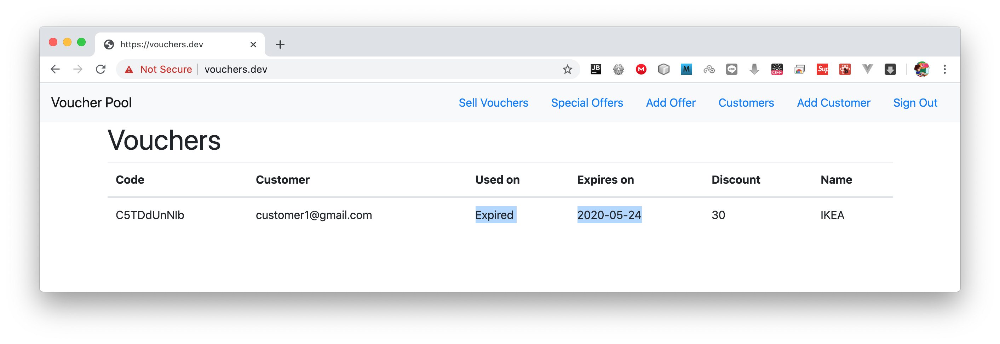

# voucher-pool

# Voucher Pool Microservice NodeJS Application
## with POSTMAN, Swagger UI, React as client & NextJS for server rendering

The voucher pool system provides you the ability to create customers and allocate voucher codes to them based on a special offers you create.

A voucher pool is a collection of voucher codes that can be used by customers to get discounts on website. Each code may only be used once, and we would like to know when it was used by the customer. Since there can be many customers in a voucher pool, we need a call that auto-generates voucher codes for each customer. Here’s a screenshot to give you an idea what it looks like:


### Database

The database used in this project is MongoDB

I designed my tables for the application as shown below


### Prerequisites

- Node: You can install it from `https://nodejs.org/en/`
- Docker: You can install it from `https://docs.docker.com/get-docker/`
- NGINX Ingress Controller: You can grab it from `https://kubernetes.github.io/ingress-nginx/deploy/`
- Skaffold: Here it is `https://skaffold.dev/docs/install/`

### Installing

##### Checkout the project from git

```
git clone https://github.com/dahan5/voucher-pool.git
```

## To run the application

I will go step by step to explain how to run the application.

The application is structured as follows


The project is devided in multi folder:

#### common

Module to handle all common code among all modules.
It contains two main functionalities:
- Middlewares
- Errors

Middleware are used to interpect any call or route and do some functionality and based on the result, the request could contiue or not.

Errors are used to be thrown when the application needs to do it.

I decided to make common files in this module to avoid the copy/paste of the code between different modules.
And to not go with the option of local git and push the code inside and pull it when needed, I decided to go the the NPM library way.

So, I build it a library and I publish it on NPM:

`https://www.npmjs.com/package/@feqra/voucher-pool-common`

I keep the code inside the project for the purpose of learning.
In fact, all the codes inside this module are fetched form the online library

#### auth

Module responsible for the SignUp, SignIn, SignOut and prepare the current logged in user

I made this application to manage all authentication needed when the application communicates with the back to create, update or delete an item.

I used the Cookie based security with JWT authentication mechanism

#### client

React Web application to display and show the ability of the Microservice API I built using NodeJS.
This application has the power to render on server.
I used Next.JS and the magic fucntion *getInitialProps* to complete it

#### vouchers

Here is the core features for the application with the user can do the following:

- Create a customer
- Update a customer information
- Create a special offer
- Update a special offer
- Create a Voucher Code
- Use a Voucher Code
- Validate a Voucher Code and return the discount and the name of the offer
- Show Customer vouchers as status: New, Used, Expired, All

#### How to run

To make it easy to run, I did lot of Kubernetes yaml configuration files where they will take automatically ALL docker files with all changes that may happen during development and keep deploying ALWAYS the latest version in the containers.

Before starting, let's do some needed configuration.

If you are using Mac and you have VSCode, you can do the following:

```
code /etc/hosts
```

If not, just open the hosts file in the way you like it.
On Windows, the file is under:

```
C:\Windows\System32\Drivers\etc\hosts
```

Put this line and save (if prompot for root, go for it):

```
127.0.0.1 vouchers.dev
```

Screen for the output


Then, after installing docker, go to Preferences, select Kubernetes and enable it.


You should have a screen that shows that both are running


If you are not familiar with docker and kubernetes, here some commands that could help.

These are my personal notes:

### Docker

Generic Dockerfile (with capital D)

FROM	node:alpine
WORKDIR	/app
COPY	package.json ./
RUN	npm install
COPY	./ ./
CMD	[“npm”, “start”]

To build it:
docker build .

* docker build -t feqra/posts .
* docker run feqra/posts
* docker run  -it feqra/posts sh (To run a shell, and to exist from it, Command D or Control D)
* docker ps
* docker exec -it [container id] [cmd]
* docker logs [container id]

### Kubernetes

#### PODS:

* kubectl apply -f posts.yaml
* kubectl get pods
* kubectl exec -it posts sh
* kubectl logs posts
* kubectl delete pod posts
* kubectl describe pod posts

#### Deployments:

* kubectl apply -f posts-depl.yaml
* kubectl get deployments
* kubectl delete deployment posts-depl
* kubectl describe deployment posts-depl

To update the deployment after doing a build in docker:
* kubectl rollout restart deployment posts-deal

Create a secret JWT
* kubectl create secret generic jwt-secret --from-literal=JWT_KEY=tradeling
Then
* kubectl get secrets 

To get namespace:
* kubectl get namespace

To list services inside specific namespace (not the default)
* kubectl get services -n ingress-nginx

##### To run tests

You can run tests in *auth* & *vouchers* modules.

I am using jest library to test my application.
I made your life easy by defining the command to run jest with all its configuration:

So,
- It will keep watching any update in the tests file and will re-run the test again
- It will understand TypeScript "preset": "ts-jest"
- It will do clean for the MongoDB memory database I am using for the test by executing the script: setup.ts

Command to run the test:
```
npm run test
```
Output for *auth* module


Output for *vouchers* module


## Running the application

ALL configuration files that will install dependencies for Node libraries, build the dockers, deploy them and make them connect are written under: infra/k8 folder

- auth-depl.yaml: responsible for build, deploy & make *auth* module available as a service for other containers
- auth-mongo-depl.yaml: MongoDB image to serve the *auth* module (DB per microservice as per the pattern)
- client-depl.yaml: our react client
- ingress-srv.yaml: to orchestrate the container, control the load balancing and make them accessible form external calls
- vouchers-depl.yaml: same as auth-depl.yaml
- vouchers-mongo-depl.yaml: same as auth-mongo-depl.yaml

To run the application, easy command: just do:

```
skaffold run
```
OR
```
skaffold dev
```

After a while, when done, open your browser on `https://vouchers.dev/`

## Important remarks

- If your chrome failed to open the URL and shows security warning and no option to accept the risk and proceed, just click on any place in the page and write:
```
thisisunsafe
```
It will open automatically

- If you are not able to see the first page of the application with an Ingress error, do the following in the console:


Based on your output, go to the file:
```
client\api\build-client.js
```
and verify that the URL is matching your configuration:
It should be:
```
http://[YOUR LOAD BALANCER NAME].ingress-nginx.svc.cluster.local
```

## API

I am providing a full documentation on Postman where you can find all exposed APIs and the URL.
You can read the documentation and test the REST API calls

Users:
```
https://documenter.getpostman.com/view/1060816/SztA6UGA
```

Vouchers:
```
https://documenter.getpostman.com/view/1060816/SztA6oD9
```

When testing on POSTMAN, don't forget to turn off the SSL from the Settings


Output


## Swagger

Swagger is also provided, you can access it through these two URLs

Users:
```
https://vouchers.dev/api/users/api-docs
```
Output


Vouchers:
```
https://vouchers.dev/api/vouchers/api-docs
```
Output


## Screens from the web application




## Authors

* **Taleb DAHAN**

## License

This project is licensed under the MIT License - see the [LICENSE.md](LICENSE.md) file for details

## Acknowledgments

* Thanks for the challenge


